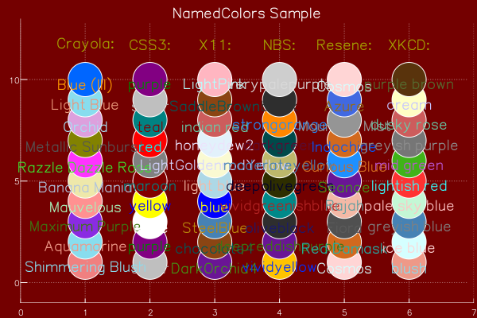
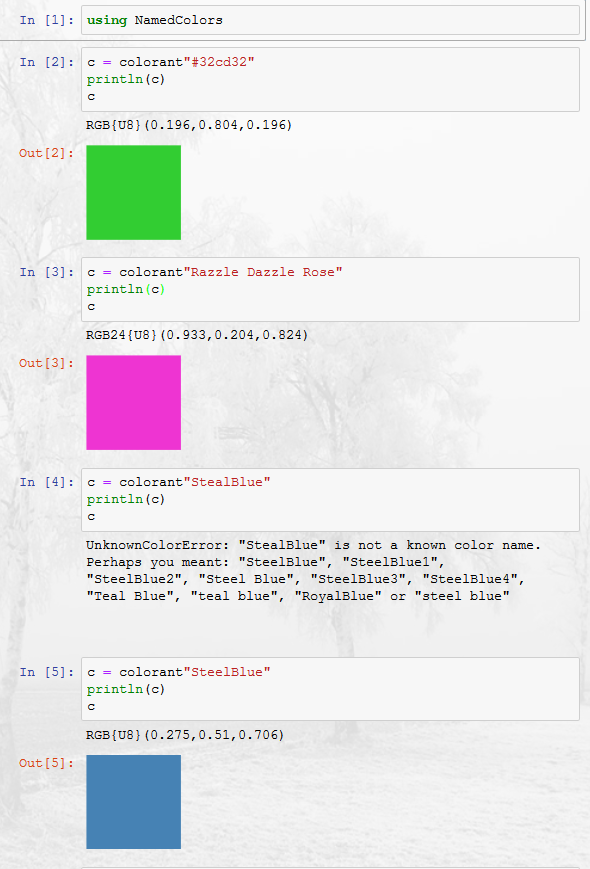

# NamedColors

[](https://travis-ci.org/oxinabox/NamedColors.jl)

[](https://coveralls.io/github/oxinabox/NamedColors.jl?branch=master)

[](http://codecov.io/github/oxinabox/NamedColors.jl?branch=master)

[Colors.jl](https://github.com/JuliaGraphics/Colors.jl#color-parsing) supports about 660 colors as named colorants.
NamedColors.jl supports about 3,500.
Honestly, the named colours in Colors.jl, and/or its capacity to generate good palletes, are far more useful.
But don't you want the quiet smugness the comes from knowing that you presentaton is colored with XKCD's *booger*;
or to really razzele dazzle them with Crayola's *Razzle Dazzle Rose*.
Perhaps you enjoy taking standardization to the next level, with the well define colours of the NBS, ranging from *oliveblack* to  *vividgreenishblue*.

[

[Code for the above chart](proto/DemoChart.ipynb)

#Usage

For most users, the main function you are interested in is the exensions to Color.jl's `colant` macro.
This does all the normal things that the `colorant` string macro did before.
But if it fails to find a color using the ones Color.jl has defined, then it goes and searchs the big list.
If it still fails to find a named color, it will give suggestions for the color you meant -- this is the easiest way to search for a color name.

[
[Code for the above usage example](proto/Usage.ipynb)

Further to this, every exported function has docstrings.
So if in doubt try:

```
?named_color
```


## Over-riding color index
The big dictionary of colors is defined by a const global `ALL_COLORS`, which has every color defined by this package.
This is used as the default source of colors, by most functions, and by the `colorant` string macro.
You can change this -- to use a different, perhaps smaller, color list.
Though it will not change already compiled uses of a `colorant` string macro. It also will not remove the webcolors that Color.jl defines.

```
julia> using NamedColors
julia> delete!.([ALL_COLORS], collect(keys(ALL_COLORS)))
julia> merge!(ALL_COLORS, load_xkcd())

Dict{String,ColorTypes.RGB24} with 949 entries:
  "chocolate"                  => RGB24{U8}(0.239,0.11,0.008)
  "light olive green"          => RGB24{U8}(0.643,0.745,0.361)
  "blue green"                 => RGB24{U8}(0.075,0.494,0.427)
  "copper"                     => RGB24{U8}(0.714,0.388,0.145)
  "pale"                       => RGB24{U8}(1.0,0.976,0.816)
  "clay brown"                 => RGB24{U8}(0.698,0.443,0.239)
  "turquoise green"            => RGB24{U8}(0.016,0.957,0.537)
  "jade"                       => RGB24{U8}(0.122,0.655,0.455)
  "dark sand"                  => RGB24{U8}(0.659,0.561,0.349)
  "cadet blue"                 => RGB24{U8}(0.306,0.455,0.588)
  "soft purple"                => RGB24{U8}(0.651,0.435,0.71)
  "kermit green"               => RGB24{U8}(0.361,0.698,0.0)
```


# Sources

 - [X11](https://en.wikipedia.org/wiki/X11_color_names) Standard Colors from the X-Windows system
 - [CSS3](https://www.w3.org/TR/css3-color/) Basic 16 Colors
 - [XKCD](https://blog.xkcd.com/2010/05/03/color-survey-results/) -- The 949 as defined by several hundred thousand participants in the xkcd color name survey.
 - [Resene](http://people.csail.mit.edu/jaffer/Color/resenecolours.txt)  1383 colours from [Resene](http://www.resene.co.nz)
 - [NBS](http://people.csail.mit.edu/jaffer/Color/Dictionaries#nbs-anthus) National Bureau of Statistics. 275 colors
 - [Crayola Crayons](https://en.wikipedia.org/wiki/List_of_Crayola_crayon_colors)  not the full set, but 197 colors
 
 


 
 
# Futher Reading
Naming colors is actually something experts exist in.
This package is one for pragmatic use, color names are more complex than many-one lookup tables can provide.

 - http://people.csail.mit.edu/jaffer/Color/Dictionaries
