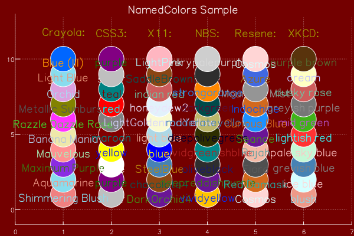
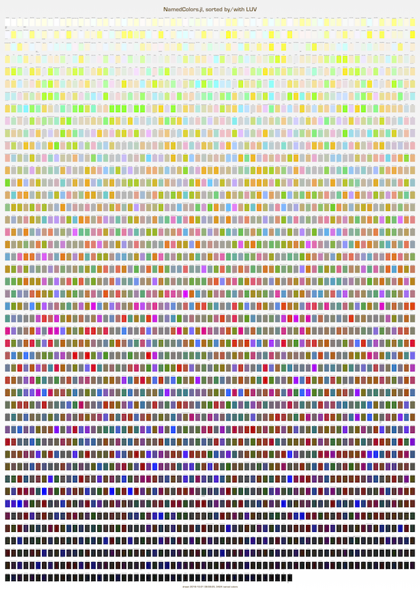
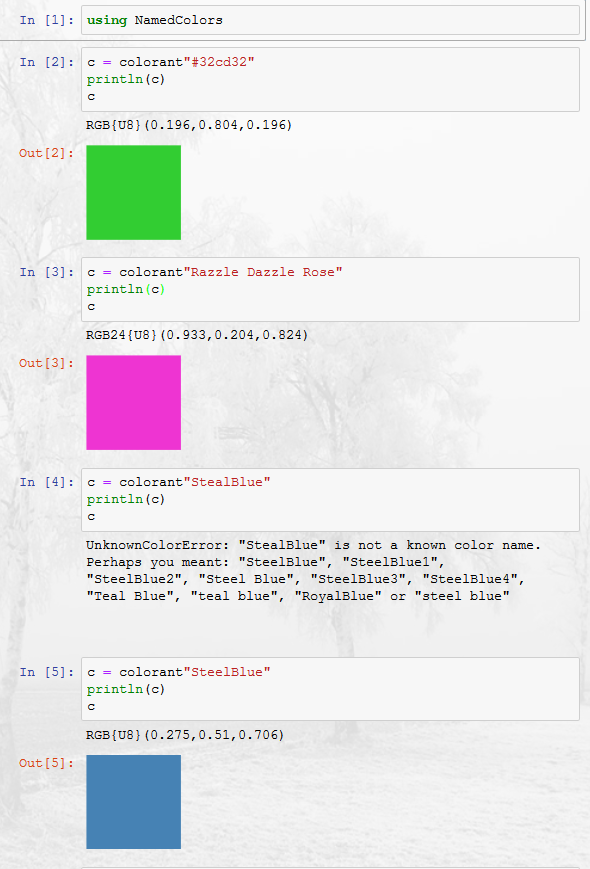

# NamedColors

[](https://travis-ci.org/JuliaGraphics/NamedColors.jl)

[](https://ci.appveyor.com/project/oxinabox/namedcolors-jl)


[](https://coveralls.io/github/oxinabox/NamedColors.jl?branch=master)

[](http://codecov.io/github/oxinabox/NamedColors.jl?branch=master)

[Colors.jl](http://juliagraphics.github.io/Colors.jl/stable/namedcolors.html) supports about 660 colors as named colorants.
NamedColors.jl supports about 4,000. 
Honestly, the named colors in Colors.jl, and/or its capacity to generate good palettes, are far more useful.

But don't you want the quiet smugness the comes from knowing that your presentation is colored with XKCD's *booger*; or to really razzle dazzle them with Crayola's *Razzle Dazzle Rose*?

Perhaps you enjoy taking standardization to the next level, with the well defined colours from the NBS, ranging from *oliveblack* to  *vividgreenishblue*.



[Code for the above chart](proto/DemoChart.ipynb)

All the colors:



[Link to full size PDF](docs/namedcolors.pdf)

[Code to generate the PDF](proto/generate-swatch-chart.jl)

# Usage

For most users, the main function you are interested in is the extensions to Color.jl's `colorant` macro.
This does all the normal things that the `colorant` string macro did before.
But if it fails to find a color using the ones Color.jl has defined, then it goes and searches the big list.
If it still fails to find a named color, it will give suggestions for the color you meant — this is the easiest way to search for a color name.



[Code for the above usage example](proto/Usage.ipynb)

Further to this, every exported function has docstrings.
So if in doubt try:

```
?named_color
```


## Over-riding color index
The big dictionary of colors is defined by a const global `ALL_COLORS`, which has every color defined by this package.
This is used as the default source of colors, by most functions, and by the `colorant` string macro.
You can change this — to use a different, perhaps smaller, color list.
Though it will not change already compiled uses of a `colorant` string macro. It also will not remove the webcolors that Color.jl defines.

```
julia> using NamedColors
julia> delete!.([ALL_COLORS], collect(keys(ALL_COLORS)))
julia> merge!(ALL_COLORS, load_xkcd())

Dict{String,ColorTypes.RGB24} with 949 entries:
  "chocolate"                  => RGB24{U8}(0.239,0.11,0.008)
  "light olive green"          => RGB24{U8}(0.643,0.745,0.361)
  "blue green"                 => RGB24{U8}(0.075,0.494,0.427)
  "copper"                     => RGB24{U8}(0.714,0.388,0.145)
  "pale"                       => RGB24{U8}(1.0,0.976,0.816)
  "clay brown"                 => RGB24{U8}(0.698,0.443,0.239)
  ...
  "turquoise green"            => RGB24{U8}(0.016,0.957,0.537)
  "jade"                       => RGB24{U8}(0.122,0.655,0.455)
  "dark sand"                  => RGB24{U8}(0.659,0.561,0.349)
  "cadet blue"                 => RGB24{U8}(0.306,0.455,0.588)
  "soft purple"                => RGB24{U8}(0.651,0.435,0.71)
  "kermit green"               => RGB24{U8}(0.361,0.698,0.0)
```

# Sources

 - [X11](https://en.wikipedia.org/wiki/X11_color_names) Standard Colors from the X-Windows system
 - [CSS3](https://www.w3.org/TR/css3-color/) Basic 16 Colors
 - [XKCD](https://blog.xkcd.com/2010/05/03/color-survey-results/) -- The 949 as defined by several hundred thousand participants in the xkcd color name survey.
 - [Resene](http://people.csail.mit.edu/jaffer/Color/resenecolours.txt)  1383 colours from [Resene](http://www.resene.co.nz)
 - [NBS](http://people.csail.mit.edu/jaffer/Color/Dictionaries#nbs-anthus) National Bureau of Statistics. 275 colors
 - [Crayola Crayons](https://en.wikipedia.org/wiki/List_of_Crayola_crayon_colors)  not the full set, but 197 colors
 - [Winsor Newton Water Colors](http://people.csail.mit.edu/jaffer/Color/Dictionaries#winsor-newton) 300 colors, based on the paints of [Winsor Newton](www.winsornewton.com/)

# Futher Reading
Naming colors is actually something experts exist in.
This package is one for pragmatic use, color names are more complex than many-one lookup tables can provide.
A lot of these colors come from the dictionaries collected by 

 - http://people.csail.mit.edu/jaffer/Color/Dictionaries


# Some of the licenses on the data files are scary
The code is MIT licensed. The datafiles are each individually lisenced.

One should be aware that you can not copyright a color.
You can trademark it, but that is a different thing, and not a concern here.
Similarly you can trademark its name, but that is still not a concern.
Trademarking protects agaist someone using your branding, as a attempt to imitate you.

What is a concern is that you can copyright the lists as a whole.
And most of the lists (except XKCD) have been copyrighted as such, but licensed for use.
The lists I am distributing are being distributed according to those licenses.
The scariest license is actually the CC-SSA from wikipedia for the Crayola color names.

But in it is all fine, the licenses are on the data, not on the code.
The code is not derived from the data -- the package as a whole is a "Collection" incorperating several works.
roughly speaking, CC-SSA imposes it's viral restrictions on Derivative Works, not on Collections (the license actually goes into some detail about this).
